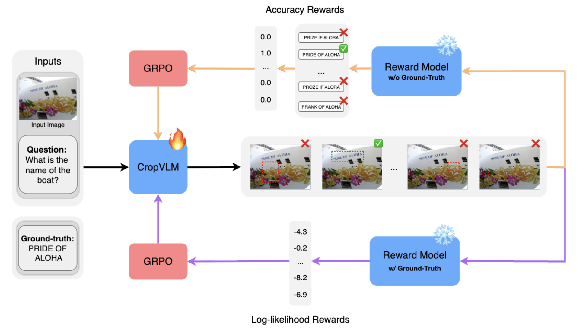

# CropVLM: Learning to Zoom for Fine-Grained Vision-Language Perception
[](https://arxiv.org/abs/2511.19820)

## Abstract
Vision-Language Models (VLMs) often struggle with tasks that require fine-grained image understanding, such as scene-text recognition or document analysis, due to perception limitations and visual fragmentation. To address these challenges, we introduce CropVLM as an external low-cost method for boosting performance, enabling VLMs to dynamically ''zoom in'' on relevant image regions, enhancing their ability to capture fine details. CropVLM is trained using reinforcement learning, without using human-labeled bounding boxes as a supervision signal, and without expensive synthetic evaluations. The model is trained once and can be paired with both open-source and proprietary VLMs to improve their performance. Our approach delivers significant improvements on tasks that require high-resolution image understanding, notably for benchmarks that are out-of-domain for the target VLM, without modifying or fine-tuning the VLM, thus avoiding catastrophic forgetting.

## Method Overview



## Env Setup
```bash
git clone https://github.com/miguelscarv/cropvlm.git
cd cropvlm
mkdir models predictions datasets
conda create -n cropvlm python=3.12
conda activate cropvlm
pip install -r requirements.txt
```

## Training
### Data Preparation

To generate the synthetic bounding box dataset used for SFT using `Qwen/Qwen2.5-VL-7B-Instruct`.
```bash
python3 create_dataset.py
```
This will, by default, apply the method described in the paper only to the TextVQA training split.
To fully replicate the paper, concatenate TextVQA, DocVQA, ST-VQA and InfographicsVQA into a single HuggingFace dataset and add `--dataset_path <DATASET_PATH>`.

### SFT Stage
First, train a model capable of generating bounding boxes in the intended format.
```bash
bash scripts/train_sft.sh 0
```

### GRPO Stage
Then, finetune the cropping network using GRPO. Be sure to replace the `--base_model` argument with the previsouly trained SFT model path.
```bash
bash scripts/train_grpo.sh 0
```

## Inference
### Bounding Box Generation

To generate bounding boxes for the TextVQA validation split.
```bash
python3 generate_bbox.py --model_path <CROPVLM_MODEL_PATH>
```
The bounding box predictions will then be stored in `predictions`.

### Final Answer Generation
To generate the final answers using SmolVLM (with and without the generated crops).
```bash
python3 generate_final_answers.py --bbox predictions/textvqa_bbox.json
```
These will also be store in `predictions`.

## Evaluation
To caculate VQA Accuracy for the predictions generated above.
```bash
python3 vqa_accuracy.py --predictions_file <PREDICTIONS_PATH>
```


## Bibtex
If you find CropVLM helpful for your work, please cite

```
@article{carvalho2025cropvlm,
  title={CropVLM: Learning to Zoom for Fine-Grained Vision-Language Perception},
  author={Carvalho, Miguel and Dias, Helder and Martins, Bruno},
  journal={arXiv preprint arXiv:2511.19820},
  year={2025}
}
```
